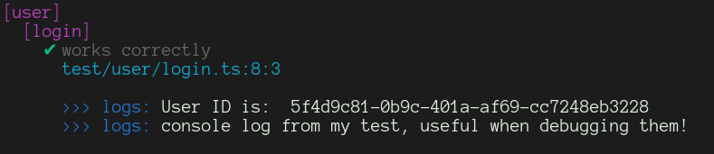

mocha-reporter
==============

Mocha reporter, enhanced.

Features
--------

### Log captures


Capture stdout and stderr, and pretty-prints it only on error or when the DEBUG environment variable
is set (like in the example above). This allows you to still leverage logging within your tests,
or even add test-specific logs.

### Pretty errors


Thrown or returned errors will look much prettier now.


It looks even better when combined with
[espower-loader](https://github.com/power-assert-js/espower-loader)!

Installation
------------

```shell
npm install --save mocha-reporter
```

Optionally, you may also add the following at the entrypoint of your test suite (it needs to be placed before any other Mocha-related calls):

```javascript
require('mocha-reporter').hook()
```

This will add an extra line containing the file name
and line number of the test upon error:


Finally, you may also set the `DEBUG` environment
to `true` to view the log output of all tests, including
the ones that passed.

> DEBUG=true npm run test



Usage
-----

Under `package.json`:

```json
{
  "scripts": {
    "test:unit": "mocha --reporter mocha-reporter"
  }
}
```

License
-------

MIT

